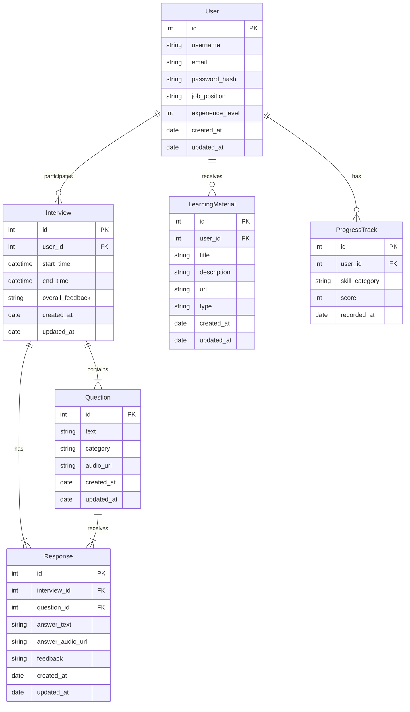

# AI 개발자 모의 면접 서비스 ERD 및 스키마 설계

## ERD (Entity-Relationship Diagram)

## 스키마 설계

### 1. User (사용자)
- id: INT (PK)
- username: VARCHAR(50)
- email: VARCHAR(100)
- password_hash: VARCHAR(255)
- job_position: VARCHAR(100)
- experience_level: INT
- created_at: TIMESTAMP
- updated_at: TIMESTAMP

### 2. Interview (면접)
- id: INT (PK)
- user_id: INT (FK to User)
- start_time: TIMESTAMP
- end_time: TIMESTAMP
- overall_feedback: TEXT
- created_at: TIMESTAMP
- updated_at: TIMESTAMP

### 3. Question (질문)
- id: INT (PK)
- text: TEXT
- category: VARCHAR(100)
- audio_url: VARCHAR(255)
- created_at: TIMESTAMP
- updated_at: TIMESTAMP

### 4. Response (응답)
- id: INT (PK)
- interview_id: INT (FK to Interview)
- question_id: INT (FK to Question)
- answer_text: TEXT
- answer_audio_url: VARCHAR(255)
- feedback: TEXT
- created_at: TIMESTAMP
- updated_at: TIMESTAMP

### 5. LearningMaterial (학습 자료)
- id: INT (PK)
- user_id: INT (FK to User)
- title: VARCHAR(255)
- description: TEXT
- url: VARCHAR(255)
- type: VARCHAR(50)
- created_at: TIMESTAMP
- updated_at: TIMESTAMP

### 6. ProgressTrack (진행 상황 추적)
- id: INT (PK)
- user_id: INT (FK to User)
- skill_category: VARCHAR(100)
- score: INT
- recorded_at: TIMESTAMP

## 설명

1. **User**: 사용자 정보를 저장합니다. 사용자의 기본 정보, 직무, 경력 수준 등을 포함합니다.

2. **Interview**: 각 면접 세션의 정보를 저장합니다. 시작 시간, 종료 시간, 전체적인 피드백 등을 포함합니다.

3. **Question**: 면접 질문들을 저장합니다. 질문 텍스트, 카테고리, 음성 파일 URL 등을 포함합니다.

4. **Response**: 사용자의 응답을 저장합니다. 텍스트 응답, 음성 응답 URL, AI의 피드백 등을 포함합니다.

5. **LearningMaterial**: AI가 추천하는 학습 자료 정보를 저장합니다.

6. **ProgressTrack**: 사용자의 기술별 진행 상황을 추적합니다. 이를 통해 시간에 따른 성장을 시각화할 수 있습니다.

이 설계는 다음과 같은 관계를 나타냅니다:
- 한 명의 사용자(User)는 여러 번의 면접(Interview)에 참여할 수 있습니다.
- 하나의 면접(Interview)은 여러 개의 질문(Question)을 포함합니다.
- 하나의 질문(Question)에 대해 하나의 응답(Response)이 있습니다.
- 한 명의 사용자(User)는 여러 개의 학습 자료(LearningMaterial) 추천을 받을 수 있습니다.
- 한 명의 사용자(User)는 여러 개의 진행 상황 기록(ProgressTrack)을 가질 수 있습니다.

이 ERD와 스키마 설계를 바탕으로 Django 모델을 구현할 수 있으며, 이는 백엔드 개발의 기초가 될 것입니다.
